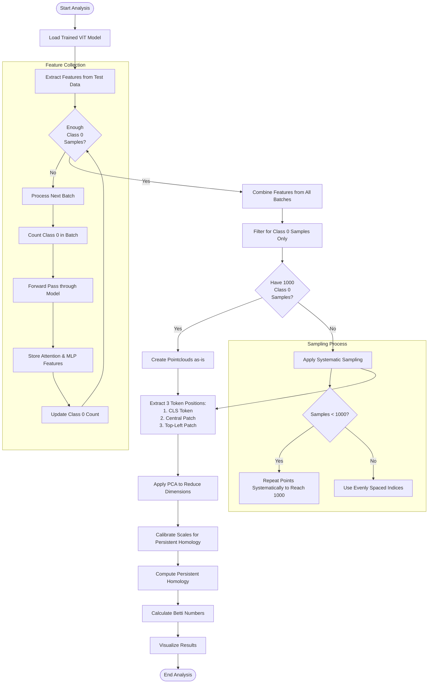

# Vision Transformer Topology Analysis Workflow

The following flowchart explains the workflow of `topology_analysis.py`, which analyzes the topological features of Vision Transformer representations.

## Process Details

1. **Feature Extraction**: 
   - Process batches of test data through the model
   - Extract attention and MLP features from each layer
   - Continue until we have at least 1000 class 0 samples or reach batch limit

2. **Pointcloud Creation**:
   - Filter features to keep only class 0 samples
   - For each layer and feature type (attention/MLP), create pointclouds for:
     - CLS token
     - Central patch (middle of image)
     - Top-left corner patch

3. **Systematic Sampling**:
   - If we have fewer than 1000 class 0 samples, systematically repeat points to reach 1000
   - If we have more than 1000 class 0 samples, use evenly spaced sampling
   - This ensures consistent pointcloud size for all analyses

4. **Topology Analysis**:
   - Apply PCA to reduce dimensionality
   - Calibrate appropriate scales for persistent homology
   - Compute persistent homology for each pointcloud
   - Calculate Betti numbers at different scales

5. **Result Visualization**:
   - Generate plots of Betti numbers across layers
   - Save numerical results as JSON

This explains the seemingly paradoxical message "Using systematic sampling to reach 1000 points from 980 samples" - the code uses systematic upsampling (repeating some points) to reach exactly 1000 points when we have fewer than 1000 samples available. 