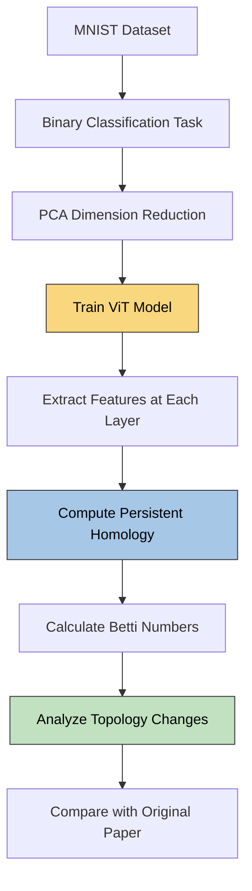
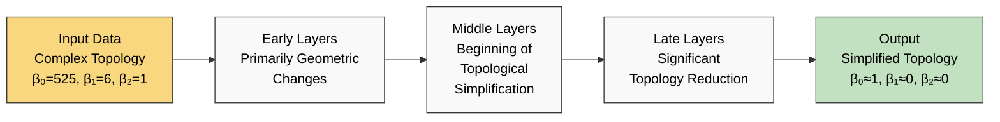

# Understanding Topology in Vision Transformers: Implementation Overview

This document explains our plan to study how Vision Transformers (ViTs) transform the topology of data, comparing results with the findings from "Topology of Deep Neural Networks" (Naitzat et al., 2020).

## Experiment Flow

## What We're Investigating

We want to discover whether ViTs simplify data topology like traditional neural networks do, and whether there are meaningful differences in *how* they accomplish this. The original paper found that feedforward networks progressively reduce topological complexity (measured by Betti numbers) as data passes through the layers.

## ViT Architecture and Analysis Pipeline

```mermaid
flowchart TD
    A[MNIST Image<br>28×28] --> B[Split into Patches<br>4×4 patches]
    B --> C[Flatten Patches]
    C --> D[Linear Projection]
    D --> E[Add Position Embeddings]
    E --> F[Add CLS Token]
    
    F --> TB1_in
    
    subgraph TB1Block[Transformer Block 1]
    TB1_in[Input] --> N1[Layer Norm]
    N1 --> MHSA1[Multi-Head<br>Self-Attention]
    MHSA1 --> ADD1[+]
    TB1_in --> ADD1
    ADD1 --> N2[Layer Norm]
    N2 --> MLP1[MLP Block<br>GELU Activation]
    MLP1 --> ADD2[+]
    ADD1 --> ADD2
    ADD2 --> TB1_out[Output]
    end
    
    TB1_out --> TB2_in
    
    subgraph TB2Block[Transformer Block 2]
    TB2_in[Input] --> N3[Layer Norm]
    N3 --> MHSA2[Multi-Head<br>Self-Attention]
    MHSA2 --> ADD3[+]
    TB2_in --> ADD3
    ADD3 --> N4[Layer Norm]
    N4 --> MLP2[MLP Block<br>GELU Activation]
    MLP2 --> ADD4[+]
    ADD3 --> ADD4
    ADD4 --> TB2_out[Output]
    end
    
    TB2_out --> dots[...]
    dots --> TB6_in
    
    subgraph TB6Block[Transformer Block 6]
    TB6_in[Input] --> N11[Layer Norm]
    N11 --> MHSA6[Multi-Head<br>Self-Attention]
    MHSA6 --> ADD11[+]
    TB6_in --> ADD11
    ADD11 --> N12[Layer Norm]
    N12 --> MLP6[MLP Block<br>GELU Activation]
    MLP6 --> ADD12[+]
    ADD11 --> ADD12
    ADD12 --> TB6_out[Output]
    end
    
    TB6_out --> H[Extract CLS Token]
    H --> I[Classification Head]
    
    E1[Extract Features] -.-> TB1_out 
    E1 -.-> TB2_out
    E1 -.-> dots
    E1 -.-> TB6_out
    E1 --> TA
    
    subgraph TABlock[Topology Analysis]
    TA[Feature Vectors] --> TA1[Group by Class]
    TA1 --> TA2[Compute Distance Matrix]
    TA2 --> TA3[Persistent Homology]
    TA3 --> TA4[Calculate Betti Numbers]
    TA4 --> TA5[Track Topology Changes]
    end
    
    classDef default fill:#f9f9f9,stroke:#333,color:black
    classDef block1 fill:#fcf1d3,stroke:#333,color:black
    classDef block2 fill:#f9e5bb,stroke:#333,color:black
    classDef block6 fill:#f9d77e,stroke:#333,color:black
    classDef topo fill:#a7c7e7,stroke:#333,color:black
    classDef attention fill:#ffcccb,stroke:#333,color:black
    classDef mlp fill:#d1f0ff,stroke:#333,color:black
    classDef add fill:#d8f8d8,stroke:#333,color:black
    
    class TB1Block block1
    class TB2Block block2
    class TB6Block block6
    class TABlock topo
    class MHSA1,MHSA2,MHSA6 attention
    class MLP1,MLP2,MLP6 mlp
    class ADD1,ADD2,ADD3,ADD4,ADD11,ADD12 add
    
    style E1 stroke:#f66,stroke-width:2px,stroke-dasharray: 5 5
```

This diagram now accurately represents the standard Transformer architecture:

1. **Explicit Residual Connections**: The residual connections are shown as addition operations (+ nodes)
2. **Complete Block Flow**: Each block shows input → output with the full internal processing
3. **Block-to-Block Connection**: The output of each block's final residual connection explicitly connects to the input of the next block
4. **Feature Extraction**: Now captures features from the block outputs after all processing

The transformer blocks now clearly show how information flows through the entire network, with each block's output (after the second residual connection) becoming the input to the next block.

## Why MNIST?

We're using MNIST because:

1. It allows direct comparison with the original paper's real-world experiment
2. It's computationally manageable for topology calculations
3. It's simple enough to train models quickly to high accuracy

## Our Approach Explained

### Data Preparation
We'll transform MNIST into a binary classification problem (digit "0" vs. non-"0") and reduce dimensions with PCA, exactly as done in the original paper. This ensures we're studying the same underlying data topology.

### ViT Architecture
We're designing a small Vision Transformer suited for MNIST:

- Input size: 28×28 grayscale images
- Patch size: 4×4 (resulting in 7×7=49 patches)
- Embedding dimension: 64 (size of token vectors after projection)
- Number of attention heads: 4 per transformer block
- Number of transformer blocks: 6 to give sufficient depth for observing progressive changes
- MLP ratio: 2 (hidden dimension in MLP is 2× the embedding dimension)
- Hooks at each layer to extract representations for topology analysis

We're keeping the architecture simple while ensuring it has enough capacity to learn the classification task to high accuracy.

### Topology Analysis
The heart of our experiment involves:

1. Extracting data representations at each transformer block
2. Computing persistent homology to determine Betti numbers
3. Tracking how these numbers change through the layers

We'll use the same scales (ε values) as the original paper for direct comparison.

### Expected Topology Changes Through Layers

### Key Questions We'll Answer

- Do ViTs simplify topology like traditional networks?
- Is the simplification pattern different (faster/slower or concentrated in specific layers)?
- Does self-attention play a special role in topology transformation compared to feedforward layers?

## Technical Implementation Simplifications

To avoid overcomplication:

- We're using a single binary classification task instead of multiple digits
- We're focusing on a subset of the test data for topology calculations
- We're using fixed parameter values rather than hyperparameter search
- We're examining a single model architecture rather than variations

These simplifications ensure we can complete the analysis efficiently while still answering our core research questions about how ViTs transform data topology. 